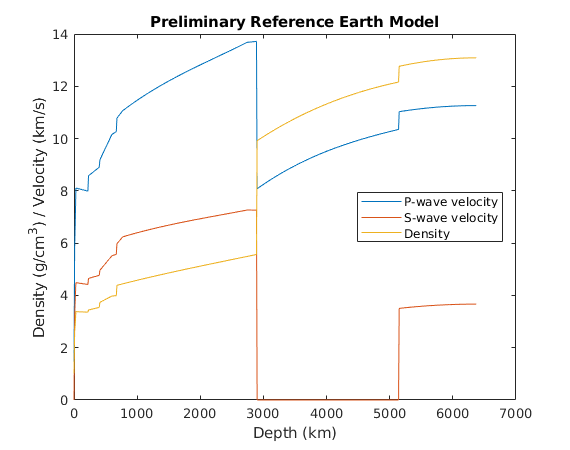
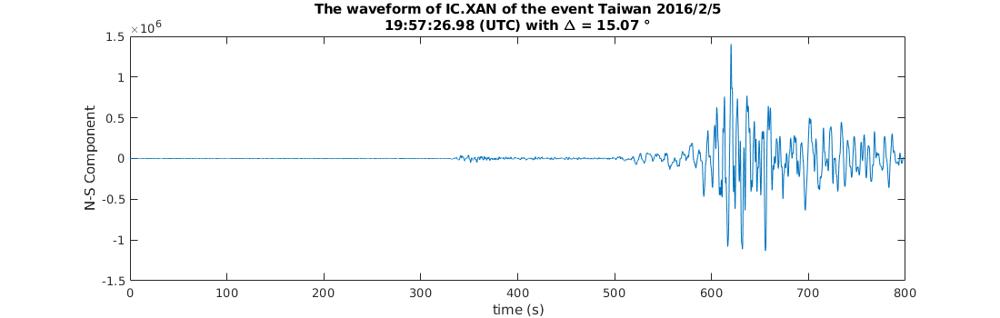

# SeisTP

Some seismology minitools and miniprograms.

## License

[The MIT License](http://tchel.mit-license.org)

## PREM

### Function

Uniformly discrete the Preliminary Reference Earth Model by the fixed depth interval (the thickness of layer).

### Usage

As an example, you can just run the follow command in  **matlab**:

```matlab
>> hintv = 10;
>> [h, vp, vs, rho] = PREM(hintv);
```

where `hintv` is the depth sampling interval, `h` is the depth from the surface of earth to the depth point, `vp` is the P-wave velocity at every depth point, `vs` is the S-wave velocity at every depth point, and `rho` is the density at every depth point.



**NOTICE**: After the uniformly discretization of PREM, the velocity variation at the discontinuity interfaces may be NOT enough accurate. If you have a strict requirement, you can make a few adjustments at the interfaces.

## ReadSAC

### Function

Read a SAC-formatted file.

### Usage

As an example, you can just run the follow command in  **matlab**:

```matlab
>> [h, d] = ReadSAC('examples/IC.XAN.00.BH1.M.2016.036.195527.SAC')
```

where `h` is file header information of the example file _examples/IC.XAN.00.BH1.M.2016.036.195527.SAC_, and `d` is waveform data in the file.



## US2016VM

### Function

Read USA velocity model from US.2016.nc distributed by [Weisen SHEN](http://ciei.colorado.edu/~weisen/index.html).

### Usage

Firstly, download the model netCDF file `US.2016.nc` from [the webpage](http://ds.iris.edu/files/products/emc/data/US.2016/US.2016.nc).

Then under the download directory start **matlab**, and keyboard input in the **matlab** command line window:

```matlab
>> pdep = [  0.0,  0.5, 150.0];
>> plat = [ 20.0, 0.25,  50.0];
>> plon = [235.0, 0.25, 295.0];
>> [vdep, vlat, vlon, vsv, vp, rho] = US2016VM('US.2016.nc', pdep, plat, plon);
```

where `pdep`, `plat` and `plon` are setting as [start, stride, end], respectively corresponding to depth, latitude and longitude; `vdep`, `vlat` and `vlon` are respectively returned value of adapted depth, latitude and longitude;  `vsv`, `vp` and `rho` are respectively retured value of S wave velocity, P wave velocity and density.

Finally, you can plot and further process with these data `vdep`, `vlat`, `vlon`, `vsv`, `vp` and `rho`.